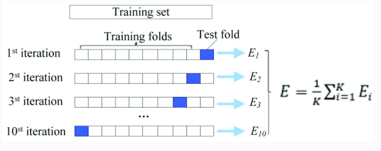

```{r setup, include=FALSE}
library(knitr)
knitr::opts_chunk$set(echo = TRUE)

library(tidyverse)
library(data.table)
library(kableExtra)
library(dplyr)
library(ggplot2)
library(gridExtra)
library(tufte)
library(readr)
library(purrr)

library(caret)
```

`The barbells and dumbbells you hold in your hands and the way you use them have stories to tell.`\
$\hspace{60pt}$ --- Craig Cecil (Bodybuilding: From Heavy Duty to SuperSlow)

# Executive Summary

Personal Monitors, such as *Fitbit*, cater to the market in fitness and training. Data from these monitors has been labeled according to how well a person is performing an activity. This project makes use of such data to build a classification model. Naive Bayes was chosen since there are a large number of observations in the data set and this algorithm is computationally less demanding than other techniques. Data wrangling and cleaning was necessary due to sparse variables. The data was also assessed for its suitability to the Naive Bayes model.

An overall accuracy of 74% was achieved. Further tuning of the model did not bring about any improvement. Prediction results on 20 test cases are also given.

# Exploratory Data Analysis

## Inductive and Deductive Data Sets

```{r}

if (!file.exists("./Data/pml-training.csv")) {
  train_url <- "https://d396qusza40orc.cloudfront.net/predmachlearn/pml-training.csv"
test_url <- "https://d396qusza40orc.cloudfront.net/predmachlearn/pml-testing.csv"
  download.file(train_url, destfile = "./Data/pml-training.csv")
  download.file(test_url, destfile = "./Data/pml-testing.csv")
}

pml_train <- read.csv("./Data/pml-training.csv",
                      stringsAsFactors = FALSE) %>% 
  as.data.table()
pml_test <- read.csv("./Data/pml-testing.csv", 
                     stringsAsFactors = FALSE) %>% 
  as.data.table()

library(skimr)
skimmed <- skim(pml_train)
# Omitted for brevity
# skimmed[, c(1,2,3,5,7, 8, 12, 16)] 
setDT(skimmed)

```

## Feature Variables

Is this a time series?

```{r}
pml_train[1:5, .(X, raw_timestamp_part_1, raw_timestamp_part_2)] %>%
  kable()
```

*timestamp1* has repeated values while the values *timestamp2* are not sequential. In addition, participants in this study performed barbell lifts both correctly and incorrectly in five different ways. So the conclusion is that this is not a time series.

### Character Variables

33 character variables have 19216 observations with no value recorded. These sparse variables have little effect on the response variable.

```{r}
sparse_char <- skimmed[character.empty == 19216, skim_variable]
```

### Numeric Variables

From the skimmed output, many numeric variables also have 19216 missing values.

```{r}
# Identify numeric variables with 19216 missing values
sparse_num <- skimmed[n_missing == 19216, skim_variable] 
```

## EDA Findings

1.  Training data is sparse.
2.  There are 33 character vectors that are sparse and have little effect on the response variable.
3.  Similarly, 67 numeric variables have 19216 missing values.
4.  User, time and window variables are meta-data and contain no information about body movement.

## Data Cleaning

-   Remove sparse variables

```{r}
# DT[, col := val] -> col is the column name.
# DT[, (col) := val]  -> col gets evaluated and replaced with its value
# Matt Dowle, SO

pml_train[, (sparse_char) := NULL]
pml_test[, (sparse_char) := NULL]
pml_train[, (sparse_num) := NULL]
pml_test[, (sparse_num) := NULL]

# Remove meta-data
meta <- pml_train[, 1:7] %>% 
  colnames()

pml_train[, (meta) := NULL]
pml_test[, (meta) := NULL]
length(pml_train) ; length(pml_test)
```

```{r}
glimpse(pml_train) 
```

All 52 feature variables are numeric and suited to inductive learning. However, several features are close to zero. This is a problem for Naive Bayes since it results in a conditional probability of 0. The Naive Bayes formula takes the product of the conditional probabilities, which would also become 0.

Inspecting near zero variables.

```{r}
summary(pml_train[, .SD, 
                .SDcols = c("gyros_belt_x", "gyros_belt_y","gyros_belt_z",
                    "gyros_arm_x", "gyros_arm_y","gyros_arm_z",
                    "gyros_dumbbell_x", "gyros_dumbbell_y","gyros_dumbbell_z",
                    "gyros_forearm_x", "gyros_forearm_y","gyros_forearm_z"
                              )]
        )
```

=\> The three columns, "gyros_belt_x", "gyros_belt_y","gyros_belt_z", are near-zero variables. Nevertheless, omitting these variables lead to a 1.3% reduction in model accuracy. The following code is for information only.

```{r}
# zero_vars <- c("gyros_belt_x", "gyros_belt_y","gyros_belt_z")
# pml_train[, (zero_vars) := NULL]
# pml_test[, (zero_vars) := NULL]
# length(pml_train) ; length(pml_test)

```

### Collinearity

```{r}
correlation <- pml_train[, -c("classe")] %>%
  cor() 
  
sum((correlation > 0.75 | correlation < -0.75) 
    & correlation < 1) / (52*52)
```

=\> out of 2704 possible variable correlations, only about 0.3% have a correlation of greater than 0.75.

### Features distribution

Plot of the distribution for a subset of 6 features.

```{r}
pml_train %>% 
  select(roll_belt, pitch_belt, yaw_belt, roll_arm, pitch_arm, yaw_arm) %>% 
  gather(metric, value) %>% 
  ggplot(aes(value, fill = metric)) + 
  geom_density(show.legend = FALSE) + 
  facet_wrap(~ metric, scales = "free")
```

$\hspace{40pt}$ --- code source [@Boehmke]

=\> only 4 out of the 6 features approximate to a Normal Distribution.

Pre-processing with a `Box-Cox`\` transformation will help bring conformance to Normality. In addition, using a non-parametric kernel density estimator can give a more accurate representation of continuous variable distributions [@Boehmke].

## Response Variable

```{r}
pml_train[, classe := as.factor(classe)]

cat("The response variable, Classe, has 5 levels: \n")
levels(pml_train$classe)

```

Percentages in each class (factor level):

```{r}
options(digits = 4)
(lift_perf <- pml_train[, list(count = .N, 
                              percent = (.N/nrow(pml_train)) * 100), 
                       by = classe])

```

=\> A is the majority class but all five classes are reasonably well balanced.

# Personal Monitor Activity Classification

## Benchmark: PMData Life and Sports Activity

The PMData dataset records personal monitor data from 12 persons over 3 months [@PMData]. It includes both life and sports activity information from a Fitbit device. Authors created a multi-class classifier that has three levels. The algorithms tested were:

-   ZeroR - majority voting baseline.
-   Random Forest and
-   Classification Decision Tree (CDT)

They carried out 10-fold cross validation. Metrics to evaluate the classifier were false positive rate, precision, recall, F1-score, and Matthew Correlation Coefficient (MCC). The CDT achieved the highest MCC score.

## Multi-Class Classification

Since there are five classes in the response variable, this is an example of multi-class classification.

-   Overall evaluation metrics are averages across classes.

    -   For macro average metrics, each class has equal weight.
    -   For micro average metrics, each instance has equal weight resulting in larger classes having greater influence.

-   An important consideration is the support for each class in terms of the number of observations of each class [@Collins].

## Naive Bayes Classifier

### Justification for Naive Bayes model

1.  The modelling technique needs to be able to deal with a large number of observations. Naive Bayes models are fast compared to more advanced algorithms such as Random Forests, SVMs, and gradient boosting models. And it scales well [@Pierobon].
2.  The mathematical formulation of the Naive Bayes algorithm is agnostic to the number of classes in the response variable. So, it is suitable for multi-class classification.
3.  Naive Bayes is robust to noise or spurious data values. This is because of the assumption that the numeric variables, conditional upon class, have a Normal distribution. In the calculation of mean and standard deviation, noise values are averaged out. This means that the algorithm is robust to isolated noise points [@DataMining].
4.  Naive Bayes is robust to irrelevant features since the conditional probabilities have a uniform distribution across all classes. So they do not effect the identification of a particular class [@DataMining].
5.  Naive Bayes has proven to perform well on many real-world, complex problems [@Boehmke].

### Naive Bayes Assumptions

-   Predictors are independent.

    -   This assumption is valid given the low percentage of possible variable correlations.

-   Predictors have normal distribution.

### Cross Validation

In supervised learning, there is always the problem of over-fitting to the training data. In this case, the model optimises to reduce the error on the training data. Such a model has high variance and low bias. Another pitfall is to make strong assumptions about the data. This leads to a model that has high bias. Although it gives consistent results for new data sets, it fails to capture the underlying relationships.

However, the goal is to minimise the generalisation error (on test or hold-out data). A model that balances the trade-off between bias and variance tends to minimise the generalisation error compared to the high variance and high bias models.

```{r cv, fig.align = 'center', out.width = "75%", fig.cap = "Figure 1. Cross Validation"}

```

$\hspace{40pt}$ --- image source [@CV]

One way to find a model that achieves this balance between bias and variance is to create a model that minimises the Cross Validation (CV) error metric. Cross validation is a re-sampling technique that creates k splits or folds of the data into training and test subsets. For each fold, CV trains on the training subset and evaluates this model with the test subset. This results in k estimates of therror on the test subset $(\epsilon_1, \epsilon_2,...\epsilon_k)$. The overall evaluation metric is the average over the k folds.

-   This leads to models that are more reliable on unseen data.

## Naive Bayes Model

There are a number of options to improve the model performance [@Boehmke]:

1.  Including a \`usekernel\` parameter that relies on a kernel density estimate of the continuous variables instead of assuming a Gaussian distribution.

    1.  There is an \`adjust\` parameter that tunes the bandwidth of the kernel density estimate.

2.  The \`fL\` parameter employs a Laplace smoother to deal with cases where the probability given the class is zero.

3.  Pre-processing with a \`Box-Cox\` transform and standardisation by centre-scaling can further improve the model.

```{r, warning=FALSE}
# create response and feature data
features <- setdiff(names(pml_train), "classe")
x <- pml_train[, ..features]
y <- pml_train[, classe]

# set up 10-fold cross validation procedure
train_control <- trainControl(
  method = "cv", 
  number = 10
  )

search_grid <- expand.grid(
  usekernel = TRUE,
  fL = 1:5,
  adjust = seq(0, 5, by = 1)
)

# train model
nb.m1 <- train(
  x = x,
  y = y,
  method = "nb",
  trControl = train_control,
  preProc = c("BoxCox", "center", "scale")
  # tuneGrid = search_grid
  )

# results
nb.m1

```

### Model Results

-   Naive Bayes with 10 fold cross validation has an expected out-of-sample error, averaged over all classes, of 0.2545 (1 - 0.7455).
-   The CV training subsets contained 17,660 samples. Consequently, the testing subsets had 1962 sample size. This gives at 90-10 percent split between training and test subsets.
-   Repeating the cross validation process 5 times did not improve on the accuracy.
-   Tuning the `fL` parameter from values of 1 through to 5 did not improve accuracy.
-   `adjust = 1` results in 0.7455 accuracy. Other values do not improve upon this.

```{r}
confusionMatrix(nb.m1)
```

=\> Most of the errors occur when the true class is B, C, or D.

## Test set evaluation

> predict( *model*, *sample data*)

Predictions for 20 test cases:

```{r, warning=FALSE}
predict(nb.m1, pml_test)
```

# Conclusion

One would hope for an accuracy greater than 80%. This suggests that other techniques ought to be assessed.

# References

\bibliography{}
